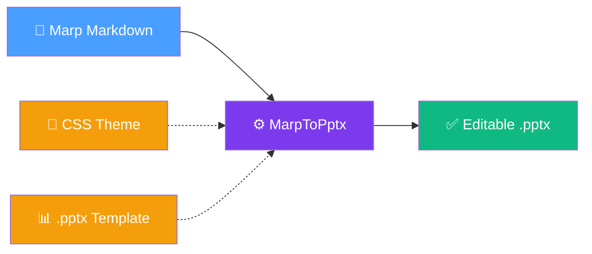

# MarpToPptx

[](https://github.com/jongalloway/MarpToPptx/actions/workflows/ci.yml)
[](https://www.nuget.org/packages/MarpToPptx/)
[](https://www.nuget.org/packages/MarpToPptx/)
[](https://dotnet.microsoft.com/)

**✨ Turn your Marp Markdown into real, editable PowerPoint files.**

So you'd like to write your presentation slides in Markdown? It's lightweight, easy to version, and works great with AI-powered workflows. The amazing [Marp](https://marp.app/) ecosystem has you covered with a mature, open-source solution for authoring beautiful slide decks in plain text:

- [**Marp**](https://marp.app/) — the Markdown Presentation Ecosystem
- [**Marp for VS Code**](https://marketplace.visualstudio.com/items?itemName=marp-team.marp-vscode) — live preview and export right in your editor
- [**Marp CLI**](https://github.com/marp-team/marp-cli) — command-line conversion to HTML, PDF, and PPTX
- [**awesome-marp**](https://github.com/marp-team/awesome-marp) — community themes, tools, and examples

There's just one hangup. When you're asked to turn in a PowerPoint deck at a conference, need to share editable slides with a colleague, or want to integrate into an existing corporate deck — you need your slides in real PowerPoint format. Unfortunately, Marp's PPTX export produces uneditable image-per-slide output that you can't select, edit, or restyle.

**That's where MarpToPptx comes in. 🎉** It reads your Marp-flavored Markdown and produces native Open XML PowerPoint files where every heading, bullet, table, and code block is a real, selectable, editable PowerPoint shape. The output opens cleanly in PowerPoint — no repair prompts, no surprises.

> Diagram support: MarpToPptx renders both `mermaid` fences and `diagram` fences through [DiagramForge](https://github.com/jongalloway/DiagramForge), so Mermaid subsets plus conceptual layouts like matrix, pyramid, funnel, and radial can be embedded directly in your deck source.



## 🚀 Quick Start

MarpToPptx requires [.NET 10](https://dotnet.microsoft.com/download). The fastest way to try it — no install needed:

```bash
dnx MarpToPptx slides.md -o slides.pptx
```

Or install it globally as a .NET tool:

```bash
dotnet tool install --global MarpToPptx
marp2pptx slides.md -o slides.pptx
```

### Apply a Theme or Template

Use a CSS theme file for Marp-style theming:

```bash
marp2pptx slides.md --theme-css brand.css -o slides.pptx
```

Or reuse an existing PowerPoint template to inherit your organization's masters and layouts:

```bash
marp2pptx slides.md --template corporate.pptx -o slides.pptx
```

To audit low-contrast slide text after generation, choose the warning level you want:

```bash
marp2pptx slides.md --template conference-template.pptx -o slides.pptx --contrast-warnings summary
marp2pptx slides.md --template conference-template.pptx -o slides.pptx --contrast-warnings detailed
```

If you want a saved text report as well:

```bash
marp2pptx slides.md -o slides.pptx --contrast-report slides-contrast.txt
```

To target a specific template layout from markdown, use `layout` in front matter for the default content layout, or `layout` / `_layout` HTML-comment directives for sticky or single-slide overrides:

```md
---
layout: Title and Content
---

<!-- _layout: Section Header -->
# Agenda
```

If the template's branded title slide is authored as slide content instead of a reusable layout, target the actual template slide directly:

```md
<!-- _layout: Template[1] -->
```

See [doc/using-templates.md](doc/using-templates.md) for the quickstart and [doc/template-authoring-guidelines.md](doc/template-authoring-guidelines.md) for the technical details.

### Re-entrant deck updates (iterative authoring)

When you iterate on a deck that was previously generated by MarpToPptx, use
`--update-existing` to reconcile against that previous managed deck:

```bash
marp2pptx deck.md --template conference-template.pptx -o deck.pptx
marp2pptx deck.md --write-slide-ids -o deck.pptx
marp2pptx deck.md --update-existing previous-deck.pptx --template conference-template.pptx -o updated-deck.pptx
```

Important distinction:

- `--update-existing previous-deck.pptx` = reconciliation source (the prior generated deck)
- `--template conference-template.pptx` = rendering source (masters, layouts, and `Template[n]`)

`--write-slide-ids` writes only missing `<!-- slideId: ... -->` directives so
future updates can match slides by stable identity. During update mode, unmanaged
slides are preserved, while changed managed slides are replaced wholesale.

## 📋 Features

| Category | What's supported |
| --- | --- |
| **Slide structure** | Front matter directives, `---` slide splitting, presenter notes |
| **Text content** | Headings, paragraphs, ordered and unordered lists, bold/italic/code spans |
| **Rich content** | Local images, syntax-highlighted code blocks, native tables, Mermaid and DiagramForge diagram fences |
| **Media** | Embedded MP3/M4A audio, embedded video |
| **Theming** | CSS-based Marp themes (fonts, colors, padding, backgrounds, typography) |
| **Templates** | Copy masters and layouts from an existing `.pptx` |
| **Directives** | `backgroundColor`, `backgroundImage`, `header`, `footer`, `paginate`, `layout`, scoped overrides |
| **Output quality** | Open XML validated, tested to open without repair prompts in PowerPoint |
| **Platform** | Runs anywhere .NET 10 runs — CI-tested on Ubuntu, works on Windows and macOS |

## 💻 VS Code Integration

Add a one-click export task to any content repository with a `.vscode/tasks.json`:

```json
{
  "version": "2.0.0",
  "tasks": [
    {
      "label": "Export to PPTX",
      "type": "shell",
      "command": "dnx",
      "args": [
        "MarpToPptx",
        "${file}",
        "-o",
        "${fileDirname}/${fileBasenameNoExtension}.pptx"
      ],
      "group": "build",
      "presentation": { "reveal": "always", "panel": "shared" },
      "problemMatcher": []
    }
  ]
}
```

Run **Terminal → Run Task → Export to PPTX** while editing a Markdown file. The `.pptx` appears next to your source file.

This repo also publishes example Agent Skills under `.github/skills/` for users who want agent-driven export flows in their own content repositories. Those skills wrap the published CLI contract such as `dnx MarpToPptx` and `marp2pptx`; they are not tied to this repo's maintainer-only PowerShell scripts and are intended to stay portable across skills-compatible tools.

For template-based export, version pinning, team sharing, example Agent Skills, and integrating the Marp for VS Code preview extension, see [`doc/vscode-workflow.md`](doc/vscode-workflow.md).

## 🎯 Sample Decks

The [`samples/`](samples/) directory contains ready-to-run Marp decks that exercise different features:

```bash
dnx MarpToPptx samples/01-minimal.md -o artifacts/samples/01-minimal.pptx
dnx MarpToPptx samples/04-content-coverage.md -o artifacts/samples/04-content-coverage.pptx
dnx MarpToPptx samples/03-theme-css.md --theme-css samples/03-theme.css -o artifacts/samples/03-theme-css.pptx
dnx MarpToPptx samples/09-diagrams.md --theme-css samples/09-diagrams.css -o artifacts/samples/09-diagrams.pptx
```

See [`samples/README.md`](samples/README.md) for the full list and suggested progression.

## 🧪 MCP Server (Experimental)

Pass `--mcp` to start the tool as a [Model Context Protocol](https://modelcontextprotocol.io/) server over stdio, giving AI assistants (GitHub Copilot, Claude, etc.) direct access to the MarpToPptx pipeline — render decks, inspect metadata, write slide IDs, and update existing presentations.

```bash
marp2pptx --mcp
```

Or with `dnx` (no install needed):

```bash
dnx MarpToPptx --mcp
```

**VS Code MCP configuration:**

```json
{
  "marp2pptx": {
    "type": "stdio",
    "command": "dnx",
    "args": ["MarpToPptx", "--mcp", "--yes"]
  }
}
```

See [doc/mcp-server.md](doc/mcp-server.md) for available tools, the iterative workflow, and Claude Desktop setup.

> **⚠️ Experimental:** The MCP server's tool surface may change between releases without notice.

## 🗺️ Roadmap

- Broader CSS coverage for advanced Marp theme features
- Smarter layout heuristics for dense or highly designed slides
- Multi-layout template mapping
- Improved table styling fidelity
- Expanded syntax highlighting themes
- Remote asset support

## 🤝 Contributing

See [`CONTRIBUTING.md`](CONTRIBUTING.md) for repository structure, conventions, building from source, packaging, and release process.

## 📖 Documentation

- [Using a PowerPoint template](doc/using-templates.md)
- [Updating existing decks safely](doc/updating-existing-decks.md)
- [Marp Markdown behavior and directives](doc/marp-markdown.md)
- [Template authoring guidelines](doc/template-authoring-guidelines.md)
- [PPTX compatibility notes](doc/pptx-compatibility-notes.md)
- [VS Code workflow integration](doc/vscode-workflow.md)
- [Agent Skills](doc/agent-skills.md)
- [Release validation checklist](doc/release-validation.md)
