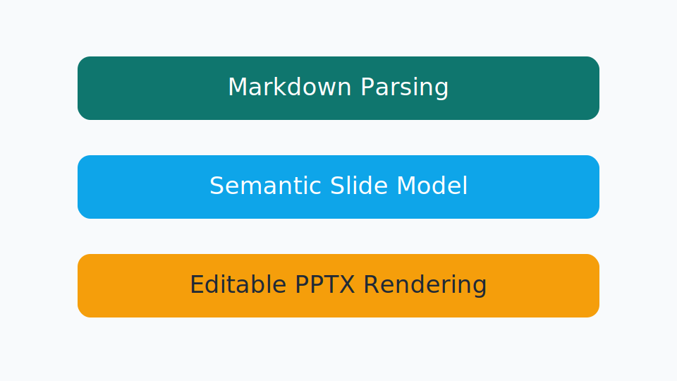
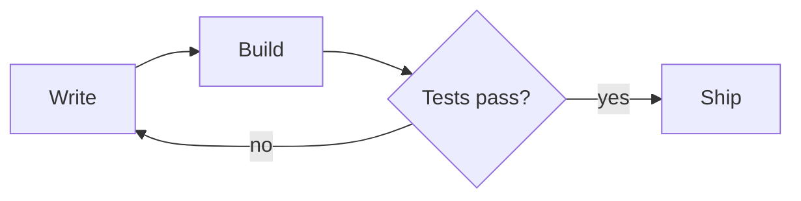

# Content Coverage

This sample mixes most of the content elements currently modeled by `MarpToPptx`.

---

## Images



The image above should be embedded from a local SVG file.

---

## Code Blocks

```json
{
  "title": "MarpToPptx",
  "formats": ["pptx"],
  "mode": "editable"
}
```

Known languages should render with syntax-highlighted runs in the generated PPTX.

---

## Video


The local MP4 should embed as a PowerPoint video rather than falling back to missing-media text.

---

## Audio


The local MP3 should embed as a PowerPoint audio object.

---

## M4A Audio


The local M4A should embed as a PowerPoint audio object using the explicit content-type path rather than falling back to unsupported-media text.

---

## Mixed Lists

- Top-level bullet
- Another bullet
  - Nested bullet content should remain associated with the list

1. First ordered item
2. Second ordered item

---

## Native Table Rendering

| Feature | Expected Behavior |
| --- | --- |
| Table parsing | Create a `TableElement` |
| Current rendering | Native PPTX table |
| Header row | Bold text with first-row table styling |
| Alignment | Markdown column alignment should carry through |

---

## Mermaid Diagrams



Mermaid fenced code blocks are detected and rendered to SVG via DiagramForge, then embedded as a picture on the slide.
