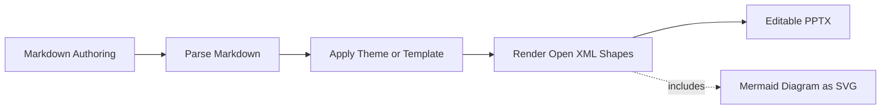

<!-- class: lead -->
<!-- _backgroundImage: url(assets/marp.svg) -->
<!-- _backgroundSize: contain -->
# MarpToPptx

✨ Turn your Marp Markdown into real, editable PowerPoint files.

<!-- Speaker note: this is the title slide. Set the stage: you love writing slides in Markdown, but sometimes you need a real .pptx. -->

---

<!-- class: -->
## Writing Slides in Markdown

- It's **lightweight** — plain text, easy to diff and review
- It's **versionable** — works naturally with Git
- It's **AI-friendly** — great with Copilot and LLM-powered workflows
- It's **fast** — focus on content, not clicking through menus

So how do you actually do it?

<!-- Speaker note: frame the value of Markdown-first authoring before introducing Marp. This resonates with developers and technical writers alike. -->

---

<!-- class: ecosystem -->
## The Marp Ecosystem

- **Marp** — the Markdown Presentation Ecosystem (marp.app)
- **Marp for VS Code** — live preview and export right in your editor
- **Marp CLI** — command-line conversion to HTML, PDF, and PPTX
- **awesome-marp** — community themes, tools, and examples

Marp is mature, open-source, and built on CommonMark with simple `---` slide breaks, front matter directives, and CSS theming.

<!-- Speaker note: the audience should understand Marp is a real ecosystem, not a toy. Mention the VS Code extension for the live preview loop. -->

---

<!-- class: contrast -->
## The Problem

When you need to **hand off a PowerPoint deck**:

- Conference submission requires `.pptx`
- Colleague wants to edit a few slides
- Corporate template needs to be applied
- Marketing needs to tweak the wording

Marp's built-in PPTX export produces **uneditable image-per-slide output** — you can't select, edit, or restyle anything.

<!-- Speaker note: this is the pain point. Let it land. Everyone in the audience has been asked to "just send the PowerPoint." -->

---

<!-- class: lead -->
## That's Where MarpToPptx Comes In 🎉

**Native Open XML PowerPoint files** where every heading, bullet, table, and code block is a real, selectable, editable shape.

No repair prompts. No surprises.

<!-- Speaker note: the key message. Pause here and let the contrast with image-per-slide sink in. -->

---

<!-- class: -->
## How It Works

1. **Parse** — reads Marp-flavored Markdown, front matter, and directives
2. **Theme** — applies CSS theme or `.pptx` template masters and layouts
3. **Render** — generates native Open XML shapes for every content element
4. **Validate** — checks against the Open XML spec before output

The result opens cleanly in PowerPoint on any platform.

<!-- Speaker note: keep this high-level. The audience cares that it works, not the implementation details. -->

---

## Mermaid Diagrams Too



Mermaid fenced blocks render as diagrams, and the diagram palette is tuned to match the deck instead of falling back to the library default colors.

<!-- Speaker note: this is a good proof slide because it mixes Markdown source with a visual output element. Call out that the colors are intentionally aligned with the deck theme. -->

---

## Quick Start

No install needed — just .NET 10:

```bash
dnx MarpToPptx slides.md -o slides.pptx
```

Or install globally as a .NET tool:

```bash
dotnet tool install --global MarpToPptx
marp2pptx slides.md -o slides.pptx
```

<!-- Speaker note: live demo moment. Show the command, open the resulting .pptx, click on a heading to prove it's editable. -->

---

## Themes and Templates

Apply a CSS theme for Marp-style theming:

```bash
marp2pptx slides.md --theme-css brand.css -o slides.pptx
```

Or reuse an existing PowerPoint template:

```bash
marp2pptx slides.md --template corporate.pptx -o slides.pptx
```

Your organization's masters, layouts, fonts, and colors carry through.

---

<!-- class: compact -->
## What's Supported

| Category | Details |
|---|---|
| **Slide structure** | Front matter, `---` splitting, presenter notes |
| **Text** | Headings, paragraphs, lists, bold/italic/code spans |
| **Rich content** | Images, syntax-highlighted code blocks, native tables |
| **Media** | Embedded audio (MP3/M4A) and video |
| **Theming** | CSS themes — fonts, colors, padding, backgrounds |
| **Templates** | Copy masters and layouts from existing `.pptx` |
| **Directives** | Background, header, footer, paginate, scoped overrides |

<!-- Speaker note: scan through quickly. The point is breadth — this isn't a proof of concept. -->

---

<!-- class: -->
## VS Code Integration

Add a one-click export task to any content repository:

```json
{
  "label": "Export to PPTX",
  "type": "shell",
  "command": "dnx",
  "args": ["MarpToPptx", "${file}", "-o", "deck.pptx"]
}
```

- Edit Markdown with live Marp preview
- Run the task when you're ready
- Hand off the `.pptx`

<!-- Speaker note: this is the workflow slide. Show that it fits naturally into a VS Code content authoring setup. -->

---

## Roadmap

- Broader CSS coverage for advanced Marp theme features
- Smarter layout heuristics for dense or designed slides
- Multi-layout template mapping
- Improved table styling fidelity
- Expanded syntax highlighting themes
- Remote asset support

<!-- Speaker note: be honest about where it's headed. The audience appreciates transparency about what's next. -->

---

<!-- class: lead -->
## Get Started

```bash
dnx MarpToPptx slides.md -o slides.pptx
```

**github.com/jongalloway/MarpToPptx**

Keep writing in Markdown. Hand off a deck anyone can edit.

<!-- Speaker note: close with the one-liner and the repo link. Invite questions. -->
