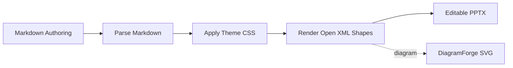
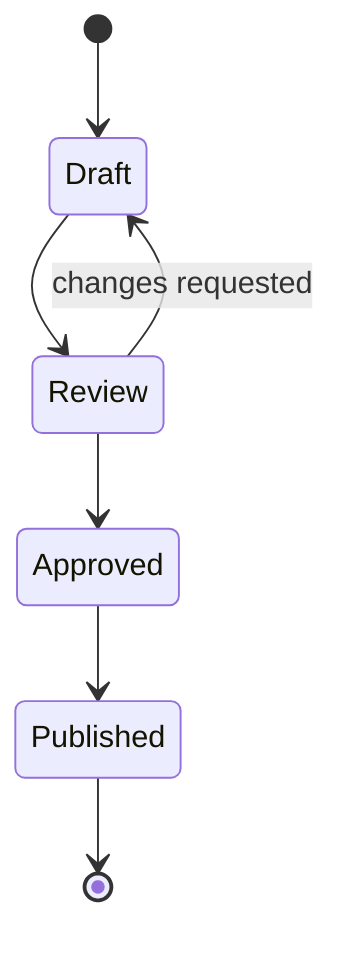
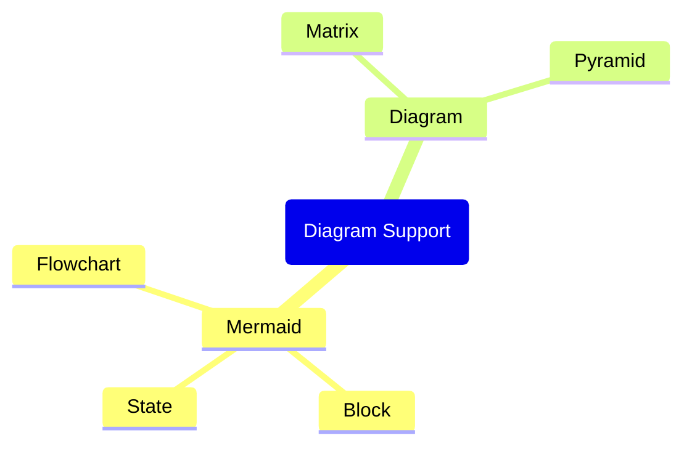
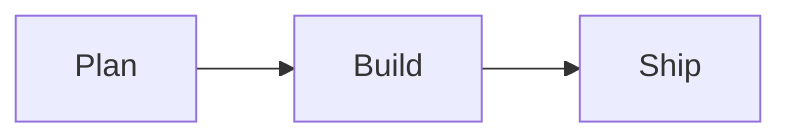

# Diagram Showcase

MarpToPptx can render both `mermaid` and `diagram` fenced blocks through DiagramForge.

---

## Mermaid Sequence



---

## Mermaid Block Diagram

```mermaid
block-beta
  columns 3
  Draft api<[[Review]]>(right) Ship
  space qa<[[QA]]>(down) space
  Archive:3
  Draft --> Ship
  Archive -- "feedback" --> Draft
```

---

## Mermaid State Diagram



---

## Mermaid Mindmap



---

## Mermaid With Dracula Theme

This Mermaid diagram uses DiagramForge frontmatter to switch to the built-in Dracula theme and apply additional styling overrides.



---

## Conceptual Matrix

```diagram
diagram: matrix
rows:
  - Important
  - Not Important
columns:
  - Urgent
  - Not Urgent
```

---

## Conceptual Matrix With Prism Theme

This conceptual diagram uses DiagramForge frontmatter to apply the built-in Prism theme inside the fenced block.

```diagram
---
theme: prism
palette: ["#6C5CE7", "#00CEC9", "#FDCB6E", "#FF7675"]
shadowStyle: soft
transparent: true
---
diagram: matrix
rows:
  - High Impact
  - Lower Impact
columns:
  - Quick Wins
  - Strategic Bets
```

---

## Conceptual Pyramid

```diagram
diagram: pyramid
levels:
  - Vision
  - Strategy
  - Delivery
  - Feedback
```

---

## Conceptual Pyramid With Dracula Theme

```diagram
---
theme: dracula
palette: ["#FFB86C", "#8BE9FD", "#BD93F9", "#50FA7B"]
borderStyle: rainbow
shadowStyle: soft
transparent: true
---
diagram: pyramid
levels:
  - Vision
  - Strategy
  - Delivery
  - Feedback
```
