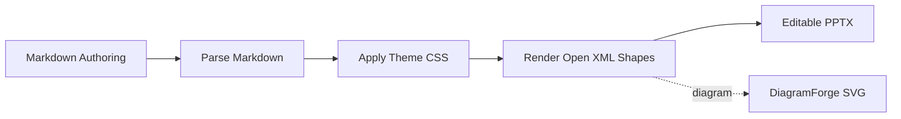
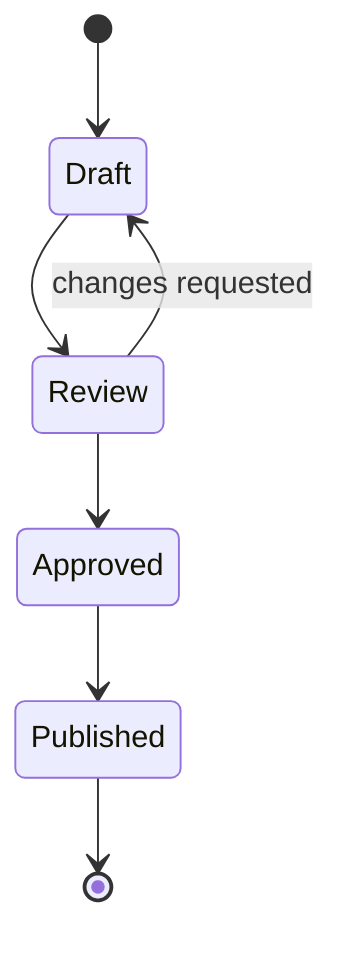
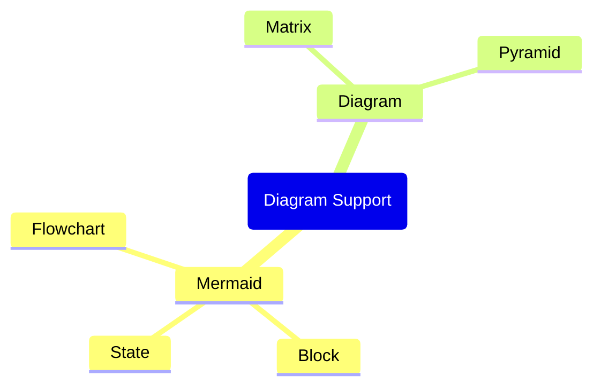
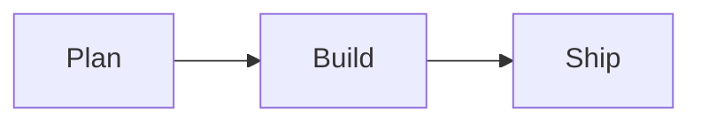

# Diagram Showcase

MarpToPptx can render both `mermaid` and `diagram` fenced blocks through DiagramForge.

This deck sets `diagram-theme: prism` in front matter as the default for all diagrams.
Individual fences can override it with their own `theme:` in embedded YAML front matter.

---

## Mermaid Flowchart

Uses the deck-level `diagram-theme: prism`.



---

## Mermaid Block Diagram

Uses the deck-level `diagram-theme: prism`.

```mermaid
block-beta
  columns 3
  Draft api<[[Review]]>(right) Ship
  space qa<[[QA]]>(down) space
  Archive:3
  Draft --> Ship
  Archive -- "feedback" --> Draft
```

---

## Mermaid State Diagram

Uses the deck-level `diagram-theme: prism`.



---

## Mermaid Mindmap

Uses the deck-level `diagram-theme: prism`.



---

## Mermaid With Dracula Theme

This Mermaid diagram uses DiagramForge front matter to override the deck-level `prism` theme with `theme: dracula`, plus additional styling options.



---

## Conceptual Matrix

Uses the deck-level `diagram-theme: prism`.

```diagram
diagram: matrix
rows:
  - Important
  - Not Important
columns:
  - Urgent
  - Not Urgent
```

---

## Conceptual Matrix With Prism Theme and Custom Palette

This conceptual diagram uses DiagramForge front matter to stay on `prism` but add a custom palette and other styling options.

```diagram
---
theme: prism
palette: ["#6C5CE7", "#00CEC9", "#FDCB6E", "#FF7675"]
shadowStyle: soft
transparent: true
---
diagram: matrix
rows:
  - High Impact
  - Lower Impact
columns:
  - Quick Wins
  - Strategic Bets
```

---

## Conceptual Pyramid

Uses the deck-level `diagram-theme: prism`.

```diagram
diagram: pyramid
levels:
  - Vision
  - Strategy
  - Delivery
  - Feedback
```

---

## Conceptual Pyramid With Dracula Theme

This conceptual diagram overrides the deck-level `prism` theme with `theme: dracula` in embedded front matter.

```diagram
---
theme: dracula
palette: ["#FFB86C", "#8BE9FD", "#BD93F9", "#50FA7B"]
borderStyle: rainbow
shadowStyle: soft
transparent: true
---
diagram: pyramid
levels:
  - Vision
  - Strategy
  - Delivery
  - Feedback
```

---

## Conceptual Pillars

Uses the deck-level `diagram-theme: prism`.

```diagram
diagram: pillars
pillars:
  - title: Microsoft.Extensions.AI
    segments:
      - IChatClient
      - Middleware
  - title: Semantic Kernel
    segments:
      - Plugins
      - Memory
  - title: Azure AI
    segments:
      - OpenAI
      - Search
```

---

## Conceptual Pillars With Presentation Theme

This conceptual diagram overrides the deck-level `prism` theme with `theme: presentation` in embedded front matter.

```diagram
---
theme: presentation
---
diagram: pillars
pillars:
  - title: Microsoft.Extensions.AI
    segments:
      - IChatClient
      - Middleware
  - title: Semantic Kernel
    segments:
      - Plugins
      - Memory
  - title: Azure AI
    segments:
      - OpenAI
      - Search
```

---

## Conceptual Funnel

Uses the deck-level `diagram-theme: prism`.

```diagram
diagram: funnel
stages:
  - Awareness
  - Evaluation
  - Conversion
```

---

## Conceptual Radial

Uses the deck-level `diagram-theme: prism`.

```diagram
diagram: radial
center: Platform
items:
  - Security
  - Reliability
  - Observability
  - Developer Experience
```
